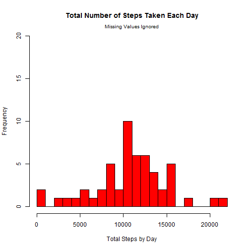
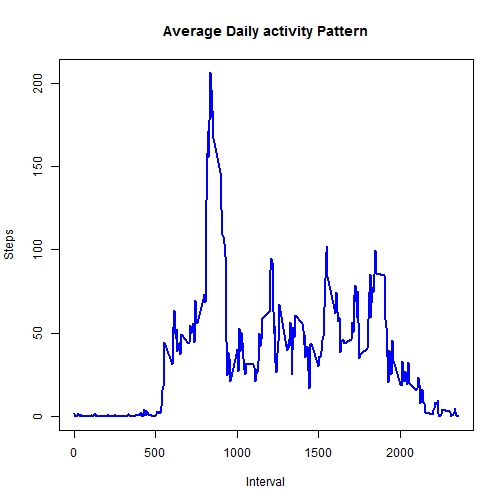
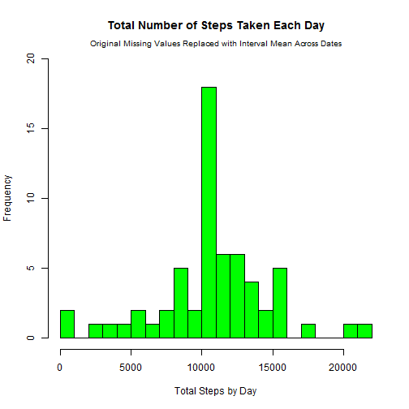
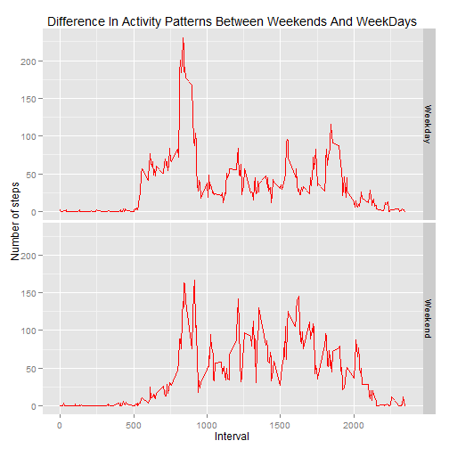

# Reproducible Research: Peer Assessment 1


## Introduction

It is now possible to collect a large amount of data about personal
movement using activity monitoring devices such as a
[Fitbit](http://www.fitbit.com), [Nike
Fuelband](http://www.nike.com/us/en_us/c/nikeplus-fuelband), or
[Jawbone Up](https://jawbone.com/up). These type of devices are part of
the "quantified self" movement -- a group of enthusiasts who take
measurements about themselves regularly to improve their health, to
find patterns in their behavior, or because they are tech geeks. But
these data remain under-utilized both because the raw data are hard to
obtain and there is a lack of statistical methods and software for
processing and interpreting the data.

This assignment makes use of data from a personal activity monitoring
device. This device collects data at 5 minute intervals through out the
day. The data consists of two months of data from an anonymous
individual collected during the months of October and November, 2012
and include the number of steps taken in 5 minute intervals each day.

## Data

The data for this assignment can be downloaded from the course web
site:

* Dataset: [Activity monitoring data](https://d396qusza40orc.cloudfront.net/repdata%2Fdata%2Factivity.zip) [52K]

The variables included in this dataset are:

* **steps**: Number of steps taking in a 5-minute interval (missing
    values are coded as `NA`)

* **date**: The date on which the measurement was taken in YYYY-MM-DD
    format

* **interval**: Identifier for the 5-minute interval in which
    measurement was taken


The dataset is stored in a comma-separated-value (CSV) file and there
are a total of 17,568 observations in this
dataset.


## Loading and preprocessing the data

The dataset comes in a zipped file already downloaded; it is necessary
to unzip it and load it into a data frame. After this, the date column
is transformed from character to date format. You can see the structure
Of the data frame generated.


```r
dfz <- suppressWarnings(unzip("activity.zip"))
df <- read.csv(dfz)
rm(dfz)
df$date <- as.Date(as.character(df$date), "%Y-%m-%d")
str(df)
```

```
## 'data.frame':	17568 obs. of  3 variables:
##  $ steps   : int  NA NA NA NA NA NA NA NA NA NA ...
##  $ date    : Date, format: "2012-10-01" "2012-10-01" ...
##  $ interval: int  0 5 10 15 20 25 30 35 40 45 ...
```


## What is mean total number of steps taken per day?

For this part of the assignment, the missing values in the dataset are
ignored and it is generated a summarized data frame of total steps by date.


```r
dfa <- aggregate(steps ~ date, data=df, FUN=sum, na.action=na.omit, na.rm=TRUE)
dfamean <- sprintf("%.2f", mean(dfa$steps))      # Calculate mean to report it later
dfamed <- sprintf("%.2f", median(dfa$steps))     # Calculate median to report it later
```

The following picture shows a histogram of the total number of steps taken each day:


```r
# Frequency limits (ylim) was defined for easier comparison with histogram of missing values replaced
hist(dfa$steps, breaks=20, main="Total Number of Steps Taken Each Day", 
     xlab="Total Steps by Day", col="red", ylim=c(0,20))
mtext("Missing Values Ignored", cex=.8)
```

 

The **mean** and **median** total number of steps taken per day are 10766.19 and 
10765.00 respectively.


## What is the average daily activity pattern?

For this part of the assignment, the missing values in the dataset are still
ignored and it is generated a summarized data frame of average number of steps
taken by 5-minutes interval, averaged across all days.


```r
dfm <- aggregate(steps ~ interval, data=df, FUN=mean, na.action=na.omit, na.rm=TRUE)
dfmmax <- sprintf("%.2f", max(dfm$steps))        # Calculate maximum average steps by interval
dfmint <- dfm[dfm$steps==max(dfm$steps),"interval"]     # Find corresponding interval
dfmintfm <-strftime(strptime(sprintf("%04d", dfmint),"%H%M"),"%I:%M %p")
```

The following figure shows the average daily activity pattern, by plotting the
average number of steps taken by 5-minutes intervals:


```r
plot(dfm$interval, dfm$steps, type="l", main="Average Daily activity Pattern", 
     xlab="Interval", ylab="Steps", lwd=2, col="blue")
```

 

On average across all the days in the dataset, the maximum number of steps 
(206.17) is found at the 5-minute interval number 835, which is the same
to say that it happens at 08:35 AM.


## Imputing missing values

There are a number of days/intervals where there are missing values (coded as NA). 
The presence of missing days may introduce bias into some calculations or 
summaries of the data.


```r
numna <- nrow(df[is.na(df),])
nasteps <- nrow(df[is.na(df$steps),])
nadate <- nrow(df[is.na(df$date),])
naint <- nrow(df[is.na(df$interval),])
```

The total number of rows with missing values in the dataset is 2304. The 
number of missing values in steps is 2304; in date is 0; in 
interval is 0. Since all missing values are in steps, and it is convenient 
to fill them, I decided to fill those missing values with the mean of steps for 
that 5-minute interval, because I think it would give a more realistic guess, 
since it is the same time of the day. However, I decided to take the rounded value
of the mean without decimals to have a more realistic value for the missing one,
since the number of steps is always an integer.

The data will be stored in a new dataset equal to the original one.


```r
names(dfm)[2] <- "meansteps"    # Rename field name
dfmrg <- merge(df,dfm)    # Merge is done by interval
dfmrg <- dfmrg[order(dfmrg$date,dfmrg$interval),]   # Reorder as original dataset
dfmrg$steps[is.na(dfmrg$steps)] <- round(dfmrg$meansteps[is.na(dfmrg$steps)],0)
dfn <- dfmrg[,c("steps","date","interval")]
rm(dfmrg)
```

Considering the new dataset with missing values replaced, now we can generate a
summarized data frame of total steps by date.


```r
dfna <- aggregate(steps ~ date, data=dfn, FUN=sum, na.action=na.omit, na.rm=TRUE)
dfnamean <- sprintf("%.2f", mean(dfna$steps))      # Calculate mean to report it later
dfnamed <- sprintf("%.2f", median(dfna$steps))     # Calculate median to report it later
```

The following picture shows a histogram of the total number of steps taken each day:


```r
hist(dfna$steps, breaks=20, main="Total Number of Steps Taken Each Day", 
     xlab="Total Steps by Day", col="green", ylim=c(0,20))    # Same frequency limits as before
mtext("Original Missing Values Replaced with Interval Mean Across Dates", cex=.8)
```

 

The **mean** and **median** total number of steps taken per day are 10765.64 and 
10762.00 respectively. These values are slightly different from the ones calculated
when ignoring the missing values. However, when we compare both histograms, we can
see a clear increase in the total number of daily steps, specially in the section for
the mean and median values (that are very similar); this is a logical effect, since we
chose to replace the missing values with the average of the steps per interval.


## Are there differences in activity patterns between weekdays and weekends?

For this part of the assignment, we are using the dataset with the filled-in missing values.
The purpose is to plot the average number of steps taken, averaged across all weekday days or
weekend days, against the 5-minute intervals, so it can be easier to see the differences in
activity patterns between both types of days.

It is necessary to identify whether each date is in weekend or is a weekday (day type). For 
that purpose, it is convenient to create a new factor column indicating that classification. 
After that, it is generated a summarized data frame, averaging number of steps by interval and 
type of day.


```r
dfn$daytype <- as.factor(ifelse(weekdays(dfn$date) %in% c("Saturday","Sunday"),"Weekend","Weekday"))
dfnm <- aggregate(steps ~ interval + daytype, data=dfn, FUN=mean, na.action=na.omit, na.rm=TRUE)
```

The following panel plot shows the difference in activity pattern between weekend days and 
weekdays:


```r
library(ggplot2)
g <- ggplot(dfnm, aes(x=interval,y=steps)) + geom_line(color="red") 
g <- g + facet_grid(daytype~.) + xlab("Interval") + ylab("Number of steps") 
g <- g + ggtitle("Difference In Activity Patterns Between Weekends And WeekDays")
g
```

 

This is the summary of the statistics about the total number of steps for each day type:


```r
tapply(dfnm$steps, dfnm$daytype, summary)
```

```
## $Weekday
##    Min. 1st Qu.  Median    Mean 3rd Qu.    Max. 
##    0.00    2.29   25.80   35.60   50.80  230.00 
## 
## $Weekend
##    Min. 1st Qu.  Median    Mean 3rd Qu.    Max. 
##    0.00    1.23   32.30   42.40   74.60  167.00
```

Both the panel plot and the summary show that the activity in weekdays start earlier than in 
weekends; on weekdays there is a very high activity peak, but later there is slow activity.
Meanwhile, on weekends, the starting activity peak is significantly lower, but the activity is 
higher on average than on weekdays and it stays active until later hours.
